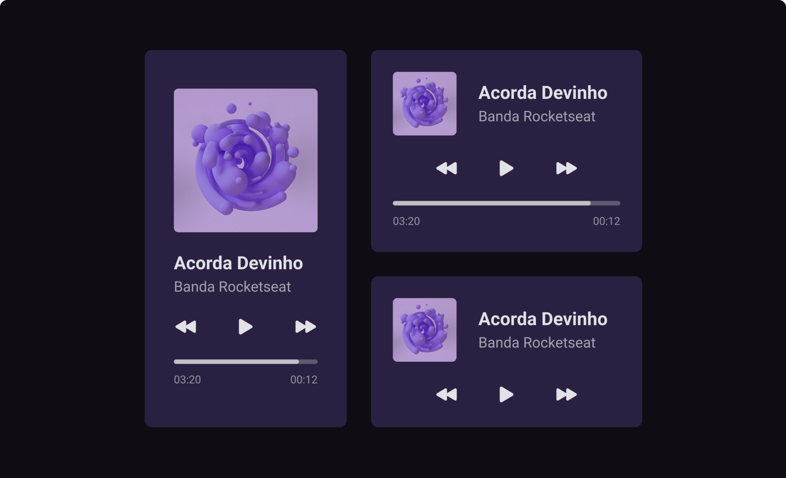

# Player Music<h1 align="center"> Player Music </h1>

Esse projeto foi desenvolvido durante o primeiro desafio semanal da Rocketseat, chamado #boraCodar. O projeto foi desenvolvido em html e css, foi criado somente o layout.  

  <a href="#-tecnologias">Tecnologias</a>&nbsp;&nbsp;&nbsp;|&nbsp;&nbsp;&nbsp;
  <a href="#-projeto">Projeto</a>&nbsp;&nbsp;&nbsp;|&nbsp;&nbsp;&nbsp;
  <a href="#-layout">Layout</a>&nbsp;&nbsp;&nbsp;|&nbsp;&nbsp;&nbsp;
  <a href="#memo-licença">Licença</a>

  

 

  

## 🚀 Tecnologias

Esse projeto foi desenvolvido com as seguintes tecnologias:

- HTML e CSS
- JavaScript
- Git e Github
- Figma

## 💻 Projeto

É um player de musica onde modelamos o layout com html e css e as funcionalidades em Javascript (sera ainda implementado as funcionalidades em js).

## 🔖 Layout

Você pode visualizar o layout do projeto através [DESSE LINK](<https://www.figma.com/file/WyaYRN3j3GkUIoC29iWzUD/%23boraCodar---Desafio-1-(Copy)-(Copy)?node-id=1%3A61&t=uiGP0kZqgPco0naF-0>). É necessário ter conta no [Figma](https://figma.com) para acessá-lo.

## :memo: Licença

Esse projeto está sob a licença MIT.

---

Feito junto com ♥ by Jair Torezone